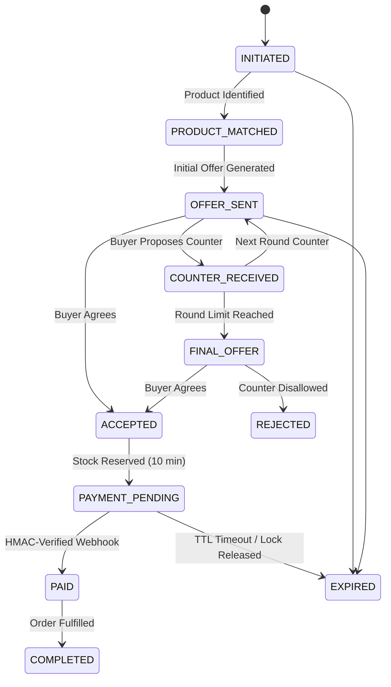

# Architecture Specification: AI Agent Negotiator
**Track: AI Growth & Agentic Commerce**

## 1. Executive Summary

Autonomous AI shopping agents are rapidly transforming e-commerce. Rather than having human buyers manually browse product detail pages, AI agents will negotiate transactions programmatically.

To win in this environment, merchants require an AI negotiator that:
1. Conducts natural language dialogue and negotiates dynamically.
2. Maximizes Expected Merchant Profit rather than giving arbitrary discounts.
3. Strictly upholds business constraints (margins, inventory, shipping costs).
4. Maintains complete financial and transactional integrity.

The core architectural principle of this system is:
> **AI Negotiates. Code Controls the Money. The Payment Provider Verifies the Transaction.**

---

## 2. Separation of Concerns

```
+-----------------------------------------------------------------------------------------+
|                                    GENERATIVE LAYER                                     |
|                                                                                         |
|  • Technology: Google Gemini API (gemini-2.5-flash)                                     |
|  • Capabilities: Intent parsing, semantic specification extraction, conversational       |
|    dialogue synthesis, explanation generation.                                          |
|  • Security Boundary: CANNOT read or set financial variables directly. Must invoke       |
|    allowlisted backend tools.                                                           |
+--------------------------------------------+--------------------------------------------+
                                             | Tool Calls Only
                                             v
+-----------------------------------------------------------------------------------------+
|                                  DETERMINISTIC LAYER                                    |
|                                                                                         |
|  • Policy Engine: Hard boolean checks (margin floors, discount caps, stock availability).|
|  • Pricing Engine: Evaluates dynamic offer candidates, calculates Expected Profit:       |
|    Expected Profit = P(Accept) * (Offer Price - Merchant Cost)                          |
|  • ML Layer: Gradient Boosting conversion model predicts calibrated P(Accept).          |
|  • Bandit Layer: LinUCB Contextual Bandit selects optimal permissible strategy.          |
|  • State Machine: Atomic state transitions, idempotency, and 10-minute stock locking.    |
+--------------------------------------------+--------------------------------------------+
                                             | Server-to-Server Lock
                                             v
+-----------------------------------------------------------------------------------------+
|                                    PAYMENT LAYER                                        |
|                                                                                         |
|  • Provider: Razorpay Sandbox Adapter / Authoritative Mock Gateway                      |
|  • Security: Server-side price lock. Webhook verification via cryptographic HMAC-SHA256.|
|  • Finality: Orders transition to PAID only upon verified webhook delivery.             |
+-----------------------------------------------------------------------------------------+
```

---

## 3. Mathematical Formulations

### 3.1 Expected Merchant Profit
For each candidate offer $i \in \mathcal{C}$ evaluated in negotiation round $t$:
$$\text{Expected Profit}_i = P(\text{Accept} \mid \mathbf{x}, \text{offer}_i) \times \text{Margin}_i$$
Where:
$$\text{Margin}_i = \text{Price}_i - \left( \text{Cost}_{\text{procurement}} + \text{Shipping Subsidy}_i + \text{Bundle Cost}_i \right)$$

### 3.2 Purchase Probability Model
We model the probability of an autonomous shopping agent accepting an offer using a calibrated Gradient Boosting Classifier trained on synthetic negotiation elasticity distributions:
$$P(\text{Accept} \mid \mathbf{x}) = \sigma\left( \mathbf{w}^T \phi(\mathbf{x}) \right)$$
**Input Features:**
1. `offer_price`: Proposed transaction price.
2. `base_price`: Standard listing price.
3. `discount_pct`: Percentage discount from listing price.
4. `buyer_budget`: Stated buyer maximum budget.
5. `budget_gap`: $\text{offer\_price} - \text{buyer\_budget}$.
6. `budget_gap_pct`: Percentage by which offer exceeds budget.
7. `product_relevance`: Semantic search cosine similarity score.
8. `inventory_quantity`: Available units in stock.
9. `inventory_age_days`: Time item has spent in warehouse.
10. `delivery_days`: Estimated logistics fulfillment days.
11. `urgency_score`: Latent buyer deadline pressure.
12. `negotiation_round`: Current round ($1, 2, 3$).
13. `free_shipping`: Binary indicator of complimentary shipping.
14. `warranty_months`: Duration of warranty perk ($12$ vs $24$ months).

### 3.3 Contextual Bandit (LinUCB) with Policy Masking
To learn the most effective offer strategy online over repeated transactions, we deploy a disjoint Linear Upper Confidence Bound (LinUCB) bandit:
For each action $a \in \mathcal{A}$:
$$\hat{\boldsymbol{\theta}}_a = \mathbf{A}_a^{-1} \mathbf{b}_a$$
$$\text{UCB}_a = \hat{\boldsymbol{\theta}}_a^T \mathbf{x} + \alpha \sqrt{\mathbf{x}^T \mathbf{A}_a^{-1} \mathbf{x}}$$
**Action Space $\mathcal{A}$:**
`FULL_PRICE`, `DISCOUNT_2`, `DISCOUNT_4`, `DISCOUNT_6`, `FREE_SHIPPING`, `WARRANTY`, `BUNDLE`.

**Policy Masking:**
Before the bandit selects an action, the deterministic Policy Engine filters $\mathcal{A}$:
$$\mathcal{A}_{\text{permissible}} = \{ a \in \mathcal{A} \mid \text{PolicyCheck}(a) = \text{True} \}$$
The bandit is restricted to selecting:
$$a^* = \arg\max_{a \in \mathcal{A}_{\text{permissible}}} \left( \text{ExpectedProfit}_a + \text{UCB\_Bonus}_a \right)$$

---

## 4. Merchant Policy Constraints

The Policy Engine executes deterministic checks in milliseconds:

1. **Round Limit Check:**
   $$\text{current\_round} \le \text{policy.max\_negotiation\_rounds}$$
2. **Stock Availability Check:**
   $$\text{quantity} - \text{reserved\_quantity} > 0$$
3. **Scarcity Conservation Rule:**
   $$\text{If } \text{available\_stock} \le \text{policy.low\_stock\_threshold} \implies \text{max\_discount} \le \text{policy.low\_stock\_max\_discount}$$
4. **Aging Inventory Clearance Boost:**
   $$\text{If } \text{inventory\_age\_days} \ge \text{policy.aging\_threshold\_days} \implies \text{max\_discount} = \text{max\_discount} + \text{boost}$$
5. **Margin Floor Verification:**
   $$\text{Realized Margin} \ge \text{policy.min\_margin}$$
6. **Price Floor Verification:**
   $$\text{Discount \%} \le \text{policy.max\_discount\_pct}$$
7. **Delivery Feasibility:**
   $$\text{requested\_delivery\_days} \ge \text{policy.min\_delivery\_days}$$

---

## 5. State Machine Transitions



---

## 6. Hybrid Product Search

Retrieval pipeline:
1. **Natural Language Specification Extraction:** Regex and token parsing extract:
   - Budget ceiling (`<= 80k`, `under 80,000`)
   - RAM minimum (`32GB`)
   - Storage minimum (`1TB SSD`)
   - Delivery maximum (`within 3 days`)
   - Category token (`laptops`)
2. **Hard Database Filtering:** Enforces RAM, Storage, Stock $>0$, and Delivery constraints. Semantic similarity cannot override hard requirements.
3. **Semantic & Financial Fit Ranking:** Ranks surviving products by:
   $$\text{Score} = 0.7 \times \text{SemanticSimilarity} + 0.3 \times \text{BudgetFit}$$
